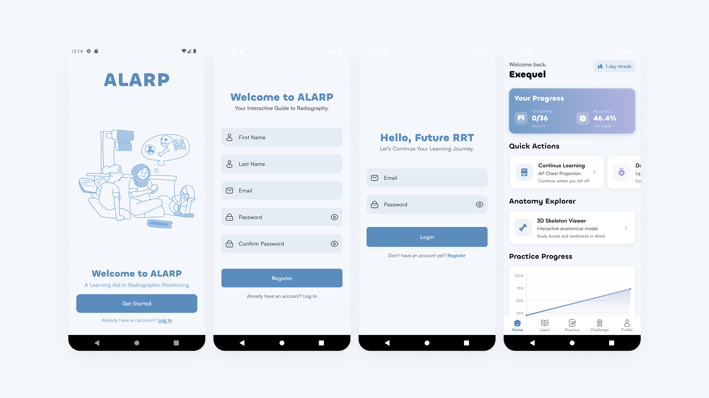
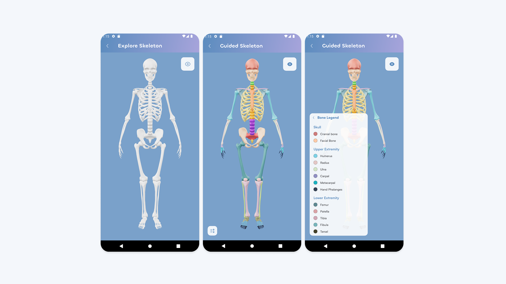
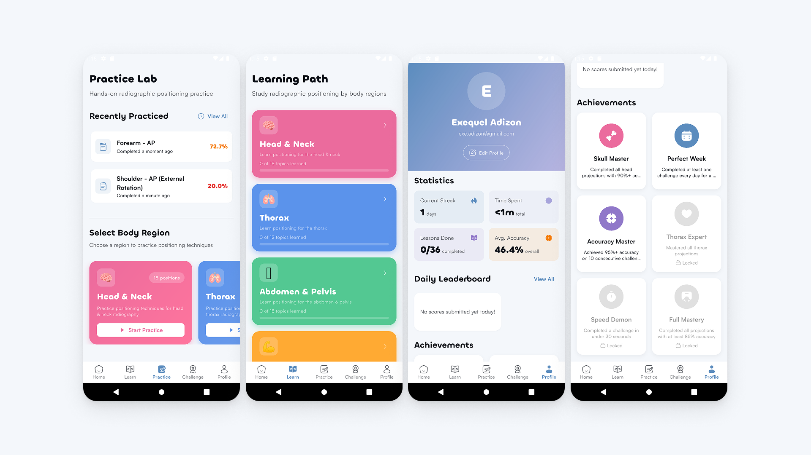
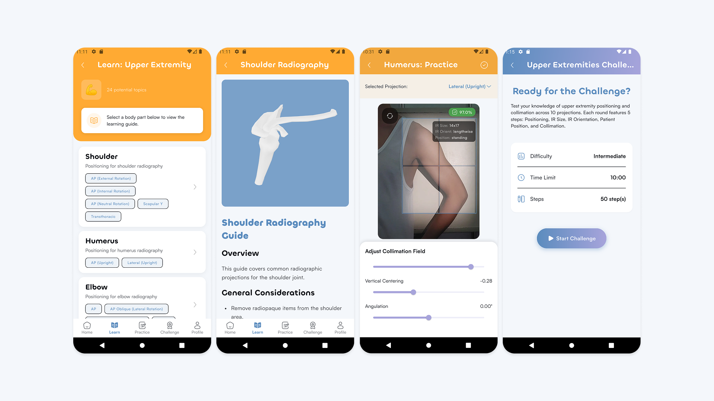
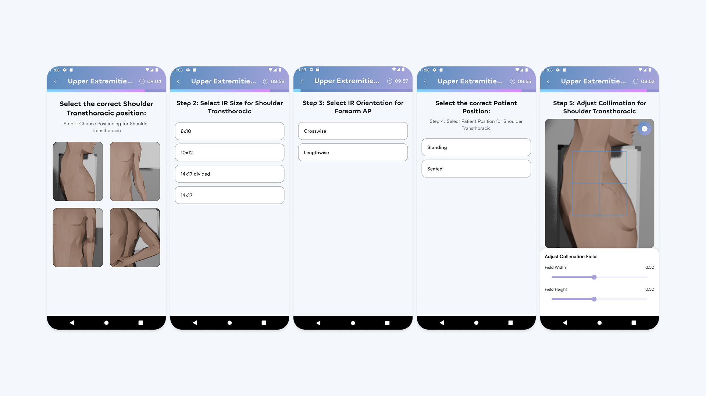

# ALARP App Showcase

**TODO: Get better app screenshots**

ALARP (A Learning Aid In Radiographic Positioning) is a comprehensive Flutter app designed for Radiologic Technology students to master radiographic positioning and collimation skills.

## 📱 App Screenshots

### Authentication & Onboarding

_User registration, login, and welcome screens with clean Material 3 design_

### 3D Anatomy Learning

_Interactive 3D skeleton viewer with bone legend and guided exploration modes_

### Learning Modules

_Educational guides for different body regions with structured positioning information_

### 2D Collimation Practice

_Real-time collimation practice with adjustable field controls and accuracy feedback_

### Gamified Challenges

_Timed challenges testing positioning knowledge and collimation skills with step-by-step progression_

## ✨ Key Features Demonstrated

- **Interactive 3D Models**: Explore skeletal anatomy with color-coded bone systems
- **2D Collimation Training**: Practice precise field adjustment on radiographic images
- **Progressive Learning**: Structured educational content by body regions
- **Gamified Assessment**: Timed challenges with scoring and leaderboards
- **Progress Tracking**: Detailed statistics and achievement systems
- **Modern UI/UX**: Clean Material 3 design with custom theming

## 🎯 Target Audience

Radiologic Technology students learning:

- Radiographic positioning techniques
- Collimation field adjustment
- Anatomy identification
- Image receptor (IR) sizing and orientation
- Patient positioning protocols
